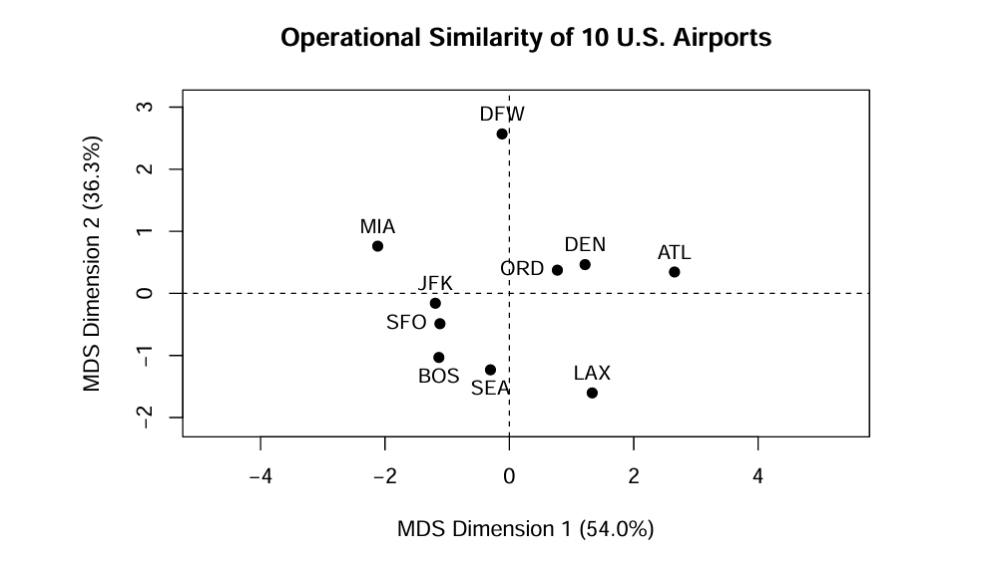

# U.S. Airport Operations Analysis
Analysis of geographic and operational similarities among 10 major U.S. airports using R and Classical MDS.

## Overview
This independent project was completed for MAT 167 at UC Davis. It explores geographic relationships and operational similarities among 10 major U.S. airports using R and Classical Multidimensional Scaling (MDS).

## Project Files
- [Full Project Report](MAT167_Final_Project.pdf)
- [R Markdown Analysis](Final%20project.rmd)

## Methods
- Geographic distance calculations
- Data standardization
- Classical Multidimensional Scaling (MDS)
- Eigenvalue decomposition
- Data visualization in R

## Key Findings
- Reconstructed the geographic relationships among 10 major U.S. airports using pairwise distances.
- Analyzed four operational metrics: passenger volume, departures, flight delay rate, and cancellation rate.
- The first two MDS dimensions retained approximately 90.26% of the variation in the operational dataset.
- Chicago O'Hare (ORD) and Denver (DEN) were the most similar airport pair based on the selected operational metrics.

## Operational Similarity Visualization

## Tools
R, Statistical Analysis, Linear Algebra, Data Visualization

## Data Sources

This project references official U.S. aviation data from the following sources:

- [Federal Aviation Administration (FAA) — CY 2024 Commercial Service Airport Enplanements](https://www.faa.gov/airports/planning_capacity/passenger_allcargo_stats/passenger/arp-cy2024-commercial-service-enplanements.pdf)
- [Bureau of Transportation Statistics (BTS) — Flight Delay and Cancellation Reporting](https://www.transtats.bts.gov/HomeDrillChart.asp)
- [Bureau of Transportation Statistics (BTS) — Airline On-Time Statistics and Delay Causes](https://www.transtats.bts.gov/OT_Delay/OT_DelayCause1.asp)

See the full project report for detailed references and methodology.

## Project Context
UC Davis — MAT 167 Final Project (2026)

Independent academic project.
